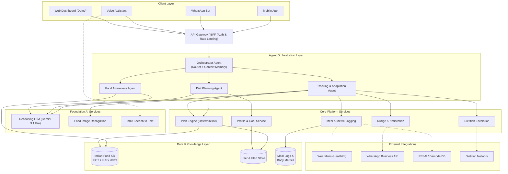
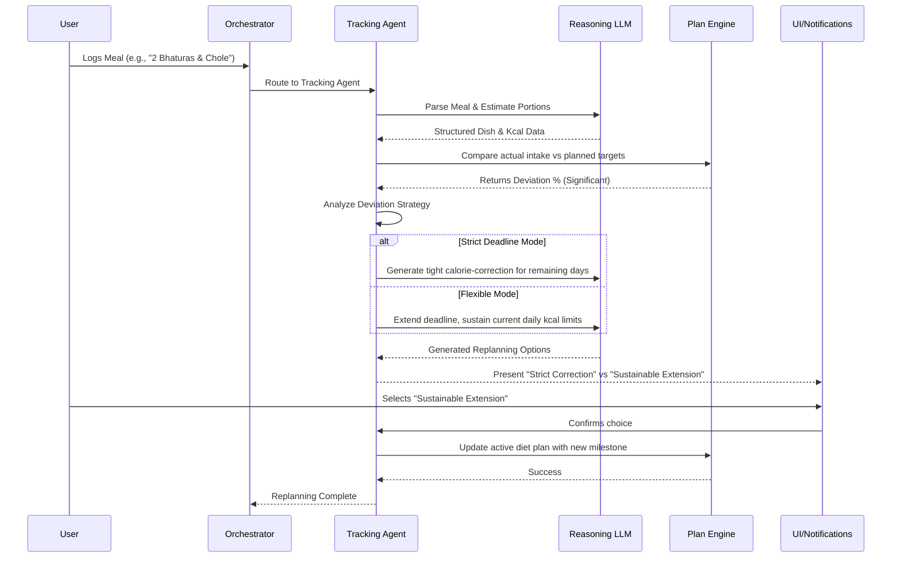
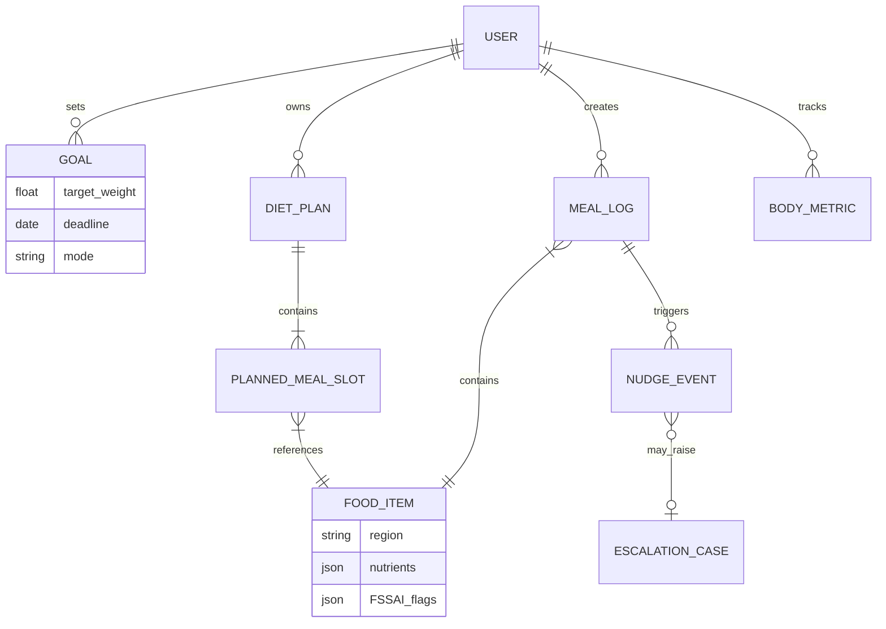

# PoshanSarthi — Your AI Nutrition Charioteer 🌿🍛

**An AI Diet-Planning, Tracking & Food-Awareness Agent for the Indian Subcontinent**


## 1. Executive Summary

PoshanSarthi is a first-of-its-kind AI nutrition agent purpose-built for the Indian subcontinent. It moves away from Western-centric "150g protein, 200g carbs" paradigms and embraces native food units—*thalis*, *rotis*, *katoris*. Designed **India-in, India-out**, it elegantly handles festival fasts (Navratri/Ramzan), tiffin services, hostel messes, and shared household kitchens. 

It unifies three core capabilities:
1. **Goal-based, cuisine-aware diet planning**
2. **Low-friction multi-modal tracking with adaptive replanning**
3. **Practical, conversational food awareness**

## 2. Product Vision & Design Principles
*“A nutrition companion that understands the Indian plate as well as it understands your goal — and changes course with you, not at you.”*

- 🌍 **Culturally Native by Default:** Regional cuisines, festival calendars, and vernacular language are core.
- 🧘 **Sustainable > Aggressive:** Prioritizes long-term consistency over crash dieting.
- ⚡ **Low-Friction Logging:** Photo, voice, text, and barcode logging (<10 seconds).
- 🔍 **Transparent Reasoning:** Agentic decisions are fully explainable.
- 👩‍⚕️ **Human Safety Net:** Escalates medical anomalies to a certified dietitian.
- 🔒 **Privacy First:** 100% DPDP Act (2023) compliant.

---

## 3. System Architecture & Diagrams

PoshanSarthi operates on an **Agentic, Multi-Agent Architecture**. This allows specialized reasoning modules (Diet Planning, Tracking, Food Awareness) to operate independently under a single Orchestrator, ensuring both high accuracy and maintainability.

### 3.1 High-Level Architecture (HLD)

The HLD maps how the client layer interacts with our AI core, which is backed by a robust RAG (Retrieval-Augmented Generation) pipeline over the Indian Food Knowledge Base.



### 3.2 Low-Level Design (LLD): Adaptive Replanning Engine

When a user logs a meal that deviates significantly from the plan, the Adaptive Replanning Engine dynamically offers corrective paths without inducing guilt.



### 3.3 Data Flow & State Management

A look at how user profile data transforms into actionable intelligence.

```mermaid
flowchart LR
    A[User Onboarding Inputs<br/>(Age, BMI, Cuisine)] --> P1(Profile & Target Calculator)
    P1 -->|Calculated Targets<br/>BMR/TDEE| P2(Diet Plan Generator)
    KB[(Food Knowledge Base)] --> P2
    P2 -->|Personalized Plan| P4(Plan vs Actual Comparator)
    
    C[Meal Image/Voice/Text] --> P3(Food Recognition & Parsing)
    P3 -->|Structured Log| P4
    
    P4 -->|Deviation Gap| P5(Adaptive Replanning Engine)
    P5 -->|Updated Plan| B[User Dashboard]
    
    C --> P6(Awareness & Insight Generator)
    KB --> P6
    P6 -->|Proactive Nudge| B
```

### 3.4 Entity Relationship Diagram (ERD)



## 4. Key Demo Features 🚀

The provided application demo focuses on an MVP subset of the PoshanSarthi system to showcase the core AI capabilities and UI/UX:
- **Rich Interactive UI:** Modern glassmorphism, dynamic animations, and vibrant Indian-themed aesthetics using Vite, React, Framer Motion, and Tailwind CSS.
- **Diet Plan Visualization:** View an AI-generated daily diet plan adapted for Indian food preferences (Thali style).
- **Conversational Awareness:** An integrated AI Chatbot replicating the "Food Awareness Agent" to answer questions like "Is it safe to eat rice at night?"
- **Meal Logging Simulator:** Demo flow showing how a user can log an off-plan meal and receive adaptive replanning choices.

## 5. Technology Stack (Demo vs Prod)

| Layer | Production Vision | Minimal Demo (Provided) |
|---|---|---|
| **Frontend** | React Native, WhatsApp API, Web | React, Vite, Framer Motion, Vanilla CSS (Glassmorphism) |
| **Backend** | Microservices, Python/Go | Simulated API within React |
| **AI Models** | Gemini 3.1 Pro + Vision + Audio | Simulated AI Responses / Client-side Gemini Integration |
| **Database** | PostgreSQL + Pinecone (Vector) | Local State (Zustand/React Context) |

## 6. How to Run the Demo

1. Clone the repository: `git clone https://github.com/ritam03/poshan-sarthi.git`
2. Navigate to the project directory.
3. Install dependencies: `npm install`
4. Run the development server: `npm run dev`

---
*Built for the future of Indian Nutrition.* 🇮🇳
